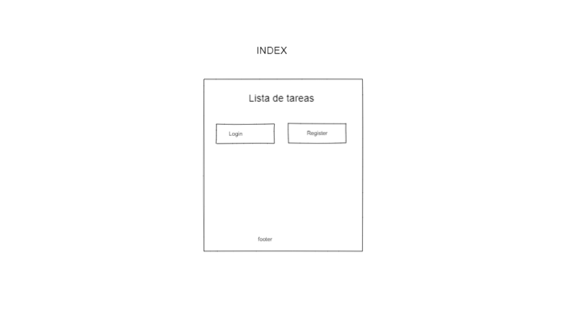
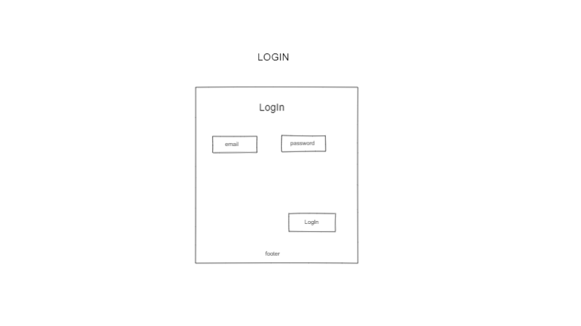
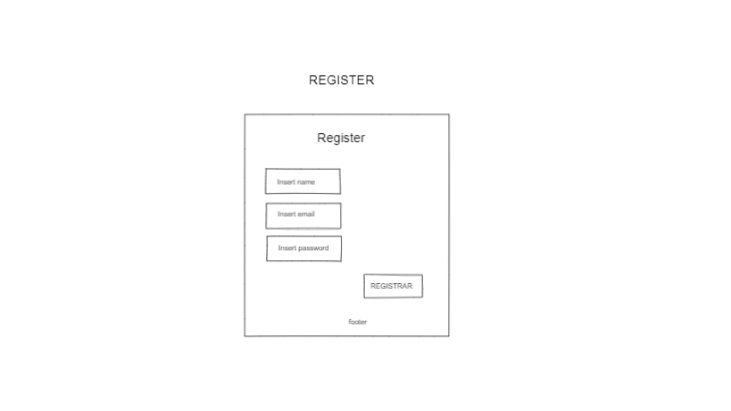
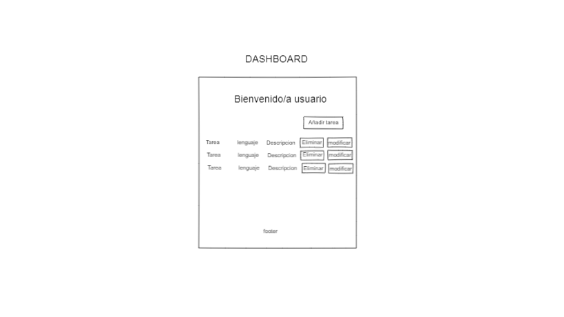
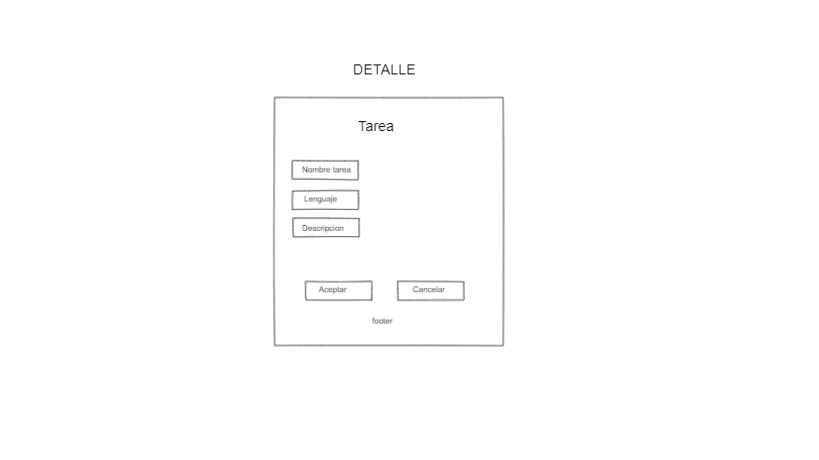
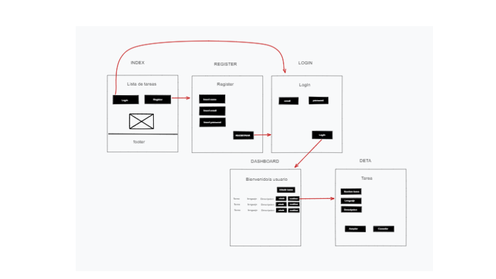

## Explicacion previa

Creación de pagina web usando JS, HTML y CSS para la parte de cliente, PHP y sql, para la parte de servidor, y una base de datos (phpMyAdmin)
Compuesto por, inicio, loguin, registro, dashboard y detalle

## Lluvia de ideas (sopesar las ideas y motivos de descarte) (10 minimo)

- Ecommerce:

  La idea principal era hacer un pequeño ecomerce, pero me ocuparia demasiado tiempo y el proyecto no se finalizaria.

- Blog de noticias:

  La descarto porquè prefiero hacer un poryecto donde pueda añadir datos a la BBDD, en esqte caso solo leeria.

- Encuaestas:

  No encuentro una buena recopilacion de enquestas con sus correcciones.

- Recetario:

  Lo mismo que blog de noticias, me gustaria hacer un CRUD con la BBDD.

- Biblioteca:

  Lo mismo que blog de noticias, me gustaria hacer un CRUD con la BBDD.

- Terminal gestion de trenes:

  No me convence la idea, lo veo muy rebuscado para el tiempo que tenemos.

- Enciclopedia:

  Me parece una buena idea pero organizar una buena base de datos para la enciclopedia me llevaria demasiado tiempo.

- Cartelera:

  Lo mismo que blog de noticias, me gustaria hacer un CRUD con la BBDD.

- Chat:

  -Me gustaria hacer un chat interactivo pero no estoy seguro de poder realizar este proyecto con el tiempo que tengo ya que necessitaria bastante tiempo para la investigación.

- Mailing:

  Un sistema de mailing donde puedes enviar plantillas de mails a todos los usuarios. Pero ya aplicare este concepto en mi proyecto.

# Nombre del proyecto: **POSIT**

## Descripcion del proyecto:

En este proyecto podremos segun nuestro login pintar una lista de tareas pendientes, donde podremos añadir, modificar o eliminar tareas.

## Descripcion de las carcteristicas

Una web que permite a los usuarios, visualizar una lista de tareas pendientes, y actualizarla segun la necesidad. El usuario tendra que registrarse y podra volver a loguear para ver sus tareas. Para registrar una tarea tendras 3 inputs, el primero para el titulo de la tarea, el segundo para que tipo de lenguaje de programación usaras y el ultimo un text area donde podras poner la descripcion de la tarea.

## Viabilidad:

### Usuarios potenciales

Los usuarios potenciales son aquellos porgramadores que necessiten anotar tareas pendientes.

### Mercado a cubrir

Programadores que necessiten de una tabla donde apuntar todas sus tareas pendientes.

## Documentacion tecnica

### Base

Se crearan 4 html y estos tendran **cargas estaticas** para pasar de una plantilla visual a otra

1 html con **carga dinamica** que cargara la tabla listando las tareas.
Utilizare CSS para el dieño.
Utilizare JS para la parte de cliente.
Utilizare PHP para la parte de servidor.
Utilizare SQL para la parte de BBDD.
Utilizare PHPmyAdmin como BBDD.

### Herramientas

Se usara GitHub para llevar el control de versiones, se usara la web phpmyadmin.co para tener una BBDD conectada constantemente, se usara Heroku para tener un servidor de php.
Se usara las librerias de AJAX

## Diagrama de grantt (se puede entregar fuera del md)

Documento aparte
[Diagrama Grantt](./Diagrama_de_Grantt.png)

## wireframes

## Paths

## Mokups

## Casos de uso

- Registrar usuario
  -Añadir nombre, telefono, email y contraseña.

- Registrar tarea
  - Tarea pendiente
  - Tipo de lenguaje a tratar
  - Descripcion
- Modificar tarea
- Eliminar tarea
- Visualizar tarea
  ### explicaopn de los casos de uso
- #### Caso de uso "Registrar tarea"

  1. Añadir tarea a realizar, tipo de lenguaje de programacion requerido de la tarea y descripcion de la tarea.

- #### Caso de uso "Modificar tarea"

  1. Modificar la tarea pendiente, modificar estilo de texto.

- #### Caso de uso "Eliminar tarea"

  1. Eliminar la tarea finalizada.

- #### Caso de uso "Visualizar tarea"

  1. Visualizar en una ventana aparte una tarea en concreto.
